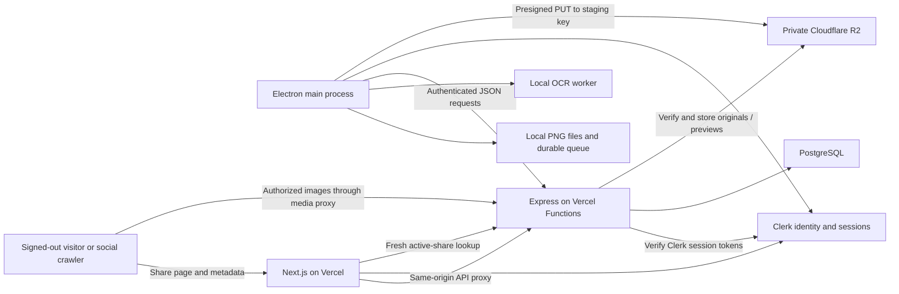

# ScreenStash — MVP Implementation Document

Version 1.6 · 10 October 2026 · Based on [screenstash-spec.md](./screenstash-spec.md), specification v0.5

**Status:** Server/web features are implemented and verified locally. Clerk authentication, uploads/private media, gallery/deletion, editing/search/filtering and public sharing pass production-mode local acceptance. Deployment readiness remains pending. Desktop authentication/capture/OCR/queue remains a separate stage.

## Implementation checkpoint — 10 October 2026

Continued from commit `c5f3609` (`feat: implement authenticated screenshot vault checkpoint`). The user approved the [server/web phase plan](docs/server-web-implementation-plan.md); remaining routine work does not need another planning approval. This checkpoint records the subsequent implementation; no deployment has been made. See the [operations runbook](docs/operations-runbook.md) for commands, configuration and release gates.

### Current implementation

| Phase | Current state |
| --- | --- |
| 1. Configuration, contracts and database | Implemented. Environment validation/loading, sanitized errors/request IDs, health/readiness, Zod contracts, typed client, ten-table Drizzle migration, pooled database adapter and isolated test harnesses. Both local disposable-database and supplied disposable-URL/schema branches verified. |
| 2. Clerk and protected web shell | Implemented. Clerk UI/SDK verification, owner/device provisioning, protected vault, account-scoped queries, bearer JSON/cookie media transport, signed deletion webhook handling and tombstones. Real development sign-in/sign-out and distinct owners verified; real webhook delivery remains pending. |
| 3. Uploads, private media and cleanup | Implemented and verified against PostgreSQL/R2. Bounded verified PNG uploads, fresh immutable final keys, retries/leases, quotas, throttles, streaming originals, durable cleanup, global/owner/process processing admission, decode deadlines and protected maintenance. Standalone development uploader, maintenance-secret utility, operations status and daily cron configuration added. |
| 4. Gallery, detail and deletion | Implemented. Lazy gallery/pagination/foreground polling, original/detail/OCR/download, accessible dialog and confirmed deletion. Responsive mobile layout, keyboard focus, owner isolation and deterministic pagination verified. Gallery tag loading is batched. |
| 5. Rename, tags, dates and search | Implemented and browser-verified. Weighted title/tag/OCR search, normalized owner-scoped tags, transactional updates, AND-tag and half-open UTC dates, filter-bound pagination, URL-preserved filters, error/empty states and editing feedback. Dialog title updates after rename; repeat finalization returns current tags. |
| 6. Public shares and social metadata | Implemented and locally verified. Hash-only random tokens, separately approved public titles, immutable stripped JPEG previews, minimal public DTOs, authorized original/preview GET/HEAD, explicit replacement/revocation, Next.js request-time public pages, blocking OG/Twitter metadata, generic unavailable views and sharing UI. Public routes are outside Clerk layouts. |
| 7. Operations and release verification | Local checks complete. Added runbook, aggregate backlog diagnostics, explicit 120-second function duration, daily maintenance schedule, quotas/rates and a manually dispatched development browser CI workflow. Remote CI execution, deployed limits/streaming/cache behavior, actual webhook delivery, backup/restore and Discord/X previews are pending. |

The Electron foundation still builds and its hidden-window smoke test passes; desktop product features are not implemented by this stage. No browser upload product flow was added.

### Verification evidence

| Check | Successful local evidence on 10 October |
| --- | --- |
| `pnpm test` | 23 unit/contracts/client/API/embedded PostgreSQL tests. |
| `pnpm test:integration` | 32 real PostgreSQL tests, including signed/forged/de-duplicated webhook events, negative Clerk JWT cases, ownership/constraints, search/tag/date pagination, shared admission, maintenance authorization, interrupted writes, account deletion during finalization, protected originals, staging expiry, public privacy/preview generation/replacement/revocation/deletion and orphan recovery. |
| `pnpm test:storage` | One live R2 test: signed direct PUT, verified finalization, idempotency, checksum and immutable original after staging overwrite. |
| `pnpm test:e2e` | Two production-runtime tests using real development Clerk/R2. Rename/tag/search/persisted filters/dates/mobile/focus passed. Public signed-out page, browser/Discord/Twitter initial HTML metadata, JPEG dimensions, 20 MiB original transfer/checksum, GET/HEAD, explicit replacement, revocation and screenshot deletion passed. |
| `pnpm check` | Lint, type checks including test/config files, and production builds across all six packages passed. |
| `pnpm format:check` | All matched source, test, configuration and operations documents passed. The specification/implementation document retain their existing formatting exclusion. |
| `pnpm smoke`, `pnpm smoke:desktop` | Production API/web/proxy/HEAD/no-store smoke and packaged Electron preload/isolation checks passed. |
| `pnpm ops:status` | Live local database aggregates: 26 pending/due cleanup jobs, no pending uploads, no active processing slots. Maintenance configured; webhook signing secret absent. |
| `pnpm ops:review-cleanup` | After final browser acceptance: 33 pending jobs, 30 due, zero active original/preview/write references, 26 associated with deleted owners. Exact read-only manifest in ignored `test-results/cleanup-review.json`; no deletions. |

The padded 20 MiB PNG proves local transfer size, not worst-case 40-million-pixel memory/runtime or deployed Vercel streaming. Local crawler metadata checks do not prove actual social-platform previews. GitHub workflow files have not been run remotely. The fixture uploader is compiled/linted; its protocol is covered by live storage/browser tests rather than a separate manual user-token invocation.

### Service state and outstanding work

- Local application database already has `0000_initial_vault.sql`; do not reset it or manually reapply its SQL. `TEST_DATABASE_URL` remains absent by the user's choice. Automatic isolated local databases work; a nested disposable-URL/schema test verifies the CI harness branch.
- Ignored local Clerk/R2/database credentials work. `CRON_SECRET` is present; the setup utility preserved it without printing it. `CLERK_WEBHOOK_SIGNING_SECRET` is still absent. No secret values or connection strings appear in these documents.
- Read-only operations inspection found 26 due cleanup jobs from earlier runs. Running that existing backlog was rejected by automatic approval review because it could delete persisted database/R2 objects without a reviewed target set. No backlog objects were deleted by that attempted operation. Review the exact targets and obtain approval before a destructive existing-backlog run. Synthetic test cleanup and recovery checks passed on their own disposable fixtures.
- Browser tests use `http://localhost:3000` matching `WEB_ORIGIN`, and API `127.0.0.1:4000`. They create disposable Clerk users and remove synthetic R2 fixtures/tombstone local accounts; Clerk deletion is still attempted if local teardown fails.
- Public links are shown only on creation. Closing the dialog discards its local URL; status returns no token. Replacing a link atomically revokes the old token. New access fails immediately after revocation/deletion commits, while already-fetched copies/platform caches may remain.
- Fresh original/preview GET/HEAD checks authorize via PostgreSQL and stream R2 bytes with no-store and generic filenames. Next.js fetches each share at request time, deduplicating only within the response; all agents receive blocking metadata. Dependency failures remain generic errors rather than false revoked-link 404s.

### Next stage

1. Review the continuation diff and commit when requested. Preserve existing user data and environment files.
2. Configure the development GitHub environment if remote browser acceptance is wanted; the manual workflow needs development Clerk and dedicated test-bucket R2 secrets.
3. For a separately authorized deployment, follow the operations runbook: configure both Vercel projects, private bucket/staging lifecycle, matching canonical origins, pooled/direct database connections, maintenance secret and real signed Clerk deletion endpoint.
4. Complete live release evidence: maximum-size proxy streaming, worst-case/concurrent Sharp processing, warmed revocation, cron execution, webhook delivery, backup/object restore and actual Discord/X previews. Do not claim production readiness until these pass.
5. Implement the separate desktop stage: Clerk renderer/session persistence, capture/OCR, durable local queue and uploader. Its foundation remains intact.

## 1. Objective and scope

Build the complete Windows capture → local OCR → durable upload → private web gallery → text search workflow, with optional public links for individual screenshots. A usable Windows installer and deployed HTTPS sharing routes are part of the MVP.

The specification is the product source of truth. Its explicit decisions are retained: use both **pnpm workspaces and Turborepo**, **exclude collections from MVP**, deploy **Next.js App Router and Express as separate Vercel projects**, and use **Clerk with its UI components for authentication**. Express runs as a Node.js Vercel Function with Fluid compute. Limits, local persistence formats, and integration details below are proposed implementation defaults.

| Include in MVP | Defer |
| --- | --- |
| Full-display and rectangular region capture; configurable global shortcuts | Video, GIFs, annotation, editing |
| Local PNG saving, local OCR, automatic uploads, offline recovery | Other operating systems, mobile apps |
| Account authentication in web and desktop | Team accounts, collaboration |
| Gallery, full-size preview, download, permanent delete, rename | Collections, semantic search, AI image understanding |
| Tags, capture-date filters, title/tag/OCR search | Public galleries, password-protected links, link expiration |
| Web-managed public links, revocation, Discord/X preview metadata | Desktop sharing, automated social posting |
| Tray controls, automatic-upload setting, startup setting | Automatic desktop updates |

Interpret “full-screen” as the complete display containing the pointer when capture starts. Region capture operates within that display. This supports multiple Windows monitors without adding stitched, cross-monitor captures. Make this behavior explicit in the UI and README.

## 2. Architecture and boundaries



The Electron renderer presents capture controls, settings, queue status, and Clerk auth components. Main owns capture, filesystem access, OCR scheduling, uploads, and Clerk's encrypted token persistence. Clerk's renderer SDK owns interactive sign-in and session-token acquisition; a restricted broker supplies short-lived tokens to main for background uploads. The application preload bridge exposes named actions/status events alongside Clerk's official narrow bridge.

Clerk owns accounts, credentials, verification, auth UI, and session renewal. Next.js owns gallery/account integration, web routing, public share pages, and server-generated metadata. Express verifies Clerk tokens and owns application-user mapping, screenshot authorization, upload sessions, database access, image validation, search, shares, and media delivery. Protected cron and bounded request-triggered work process durable database cleanup jobs. No continuously running maintenance process is assumed; shared rate limits can use PostgreSQL for MVP.

Use one browser-facing public origin on Vercel, with explicit external rewrites to the separately deployed Express origin:

```text
https://<public-host>/api/*                 → Express /api/*
https://<public-host>/s/<token>/image        → Express /s/<token>/image
https://<public-host>/s/<token>/preview.jpg  → Express /s/<token>/preview.jpg
https://<public-host>/s/<token>              → Next.js server-rendered share page
https://<public-host>/*                     → Next.js App Router

https://<api-host>/api/*                    → Express, also used directly by desktop
```

Configure the three proxy patterns as explicit `beforeFiles` external rewrites, preserving methods and paths. Do not rewrite the entire `/s/*` namespace: its page belongs to Next.js. Browser calls remain same-origin; desktop and Next.js server-side lookups use Express directly. Unknown API/media routes must not fall through to a web page. Validate Clerk bearer headers, same-origin media cookies, HEAD, status codes, and cache headers in a deployed spike. [Next.js rewrites](https://nextjs.org/docs/app/api-reference/config/next-config-js/rewrites)

Next.js does not duplicate authorization or access PostgreSQL/R2 directly. Its share loader calls the public token-authorized Express details endpoint. No frontend receives database credentials or R2 secret keys. Proxying media through Vercel adds a bandwidth hop; monitor that allowance, with direct Express-host media URLs as a future deployment option if measured traffic warrants it.

## 3. Repository and development setup

```text
screenstash/
├── apps/
│   ├── api/
│   │   └── src/
│   │       ├── config/          # Validated environment and policy defaults
│   │       ├── middleware/      # Clerk verification, owner mapping, validation
│   │       ├── modules/         # users/devices, uploads, screenshots, shares/media
│   │       ├── webhooks/        # Verified Clerk lifecycle events
│   │       ├── storage/         # R2 adapter, image verification and previews
│   │       ├── jobs/            # Durable cleanup processing
│   │       ├── index.ts        # Default-export Express app for Vercel
│   │       └── server.ts       # Local development listener only
│   ├── web/
│   │   ├── next.config.ts      # Explicit API/media rewrites and metadata policy
│   │   └── src/
│   │       ├── app/
│   │       │   ├── (account)/  # Clerk SignIn/SignUp and provider layout
│   │       │   ├── (vault)/    # Clerk-protected gallery/detail/settings
│   │       │   └── s/[token]/  # Server share page, generateMetadata, not-found
│   │       ├── lib/server/     # Server-only Express share loader
│   │       └── features/      # Client gallery, Query providers, shared components
│   └── desktop/
│       └── src/
│           ├── main/           # capture, queue, OCR, auth, settings, tray
│           ├── preload/        # Typed contextBridge API
│           └── renderer/       # React controls, settings, region overlay
├── packages/
│   ├── shared/src/             # Zod contracts, DTOs, error codes, limits
│   ├── db/                    # Drizzle schema, migrations, connection
│   └── api-client/src/         # HTTP transport and typed API methods
├── tests/                     # Cross-application acceptance fixtures/tests
├── docs/                      # Release runbook and architecture assets
├── pnpm-workspace.yaml
├── turbo.json
└── package.json
```

Bootstrap all six packages with strict TypeScript, consistent formatting/linting, and a committed lockfile. Scaffold the web app with Next.js App Router; use Vite only for Electron. Select mutually compatible supported dependency versions during bootstrap and pin the Node and pnpm toolchain; avoid floating `latest` dependencies in CI.

The shared client accepts an async session-token provider. Browser calls use relative `/api` URLs and obtain Clerk JWTs with `getToken()`; desktop main receives short-lived tokens through its auth broker and sends them to Express. Use `Authorization: Bearer <token>` for authenticated JSON requests, without minting ScreenStash tokens. The server-only public-share loader uses no-store fetching without account credentials. Preserve Zod DTOs across transports; never attach API credentials to R2 requests.

`packages/db` is imported only by API code and migration tooling. `packages/shared` exposes public request/response types, not Drizzle rows. Keep UI code within each app until real duplication appears.

| Root task | Behavior |
| --- | --- |
| `pnpm dev` | Run API, web, and Electron development tasks through Turbo |
| `pnpm build` | Build shared dependencies before applications; web runs `next build` |
| `pnpm lint`, `pnpm typecheck`, `pnpm test` | Run package checks; cache deterministic outputs |
| `pnpm test:e2e` | Run browser/API acceptance tests against test services |
| `pnpm db:migrate` | Apply committed Drizzle migrations explicitly |
| `pnpm desktop:make` | Produce a Windows installer with Electron Forge |

Mark development tasks persistent and uncached. Cache the appropriate build outputs, including `.next/**` excluding `.next/cache/**`, with environment inputs in the cache key. Database migrations and installer publishing must not be replayed from Turbo's cache. Use local PostgreSQL or a development container and a dedicated private development R2 bucket. Keep production data out of tests.

## 4. Data model and invariants

Use UUID primary keys for application records, UTC `timestamptz` timestamps, and server-generated object keys. Clerk user IDs are text identifiers mapped through `users.clerk_user_id`; internal foreign keys stay UUIDs. Express derives the internal `user_id` from the verified Clerk identity and never accepts ownership claims from request bodies.

| Table | Fields and implementation additions |
| --- | --- |
| `users` | Internal UUID, unique `clerk_user_id`, `created_at`, `deleted_at`; no passwords, credential hashes, or duplicate email identity |
| `screenshots` | Spec fields; `device_id` nullable, `capture_id`, `sha256`, `ocr_status`, `search_vector`, `deleted_at` nullable |
| `tags` | Spec fields; `normalized_name` unique within the owner |
| `screenshot_tags` | Spec fields; composite primary key; enforce same-owner associations |
| `upload_sessions` | Spec fields; `device_id`, `capture_id`, reserved `screenshot_id`, immutable expected metadata and checksum, staging `object_key`, current attempt ID, final object key, `finalized_at`, latest signed-URL expiry |
| `devices` | Spec fields; `installation_id` unique per owner; registered after verified desktop sign-in; device IDs are metadata, not credentials |
| `screenshot_shares` | Spec fields; `preview_object_key`; preview format/dimensions are fixed by generation policy; no plaintext share token |
| `webhook_events` | New: unique provider event ID, event type, processed timestamp; minimal deduplication records, no retained credential/profile payloads |
| `cleanup_jobs` | New: object key, reason, `not_before`, attempts, next attempt, lease expiry, completion timestamp |

Add database checks and indexes:

- Unique `users.clerk_user_id`; never link accounts by email or accept client-supplied Clerk IDs as authentication.
- Unique `(user_id, capture_id)` in screenshots and upload sessions. `capture_id` is a fresh client UUID per capture; it is an idempotency identifier, not authorization.
- Unique screenshot original key, share token hash, and `(user_id, normalized_name)` for tags.
- Partial unique index on `screenshot_shares(screenshot_id)` where `revoked_at IS NULL`.
- Owner/date index on `(user_id, captured_at DESC, id DESC)` for screenshots, restricted to non-deleted rows where appropriate.
- GIN index on `screenshots.search_vector`; indexes on reverse tag associations and due cleanup jobs.
- Positive size/dimension checks and bounded title, tag, OCR, and public-title fields.
- Composite owner-aware foreign keys, or equivalent transactional checks, for screenshot/tag and screenshot/share relationships. A guessed tag ID must never associate another user's tag.

Keep deleted screenshot rows as inaccessible tombstones until cleanup completes. Retain the minimal capture-id tombstone afterward to prevent a delayed desktop retry from recreating a permanently deleted capture; remove title, OCR, and organization data. Return `410 CAPTURE_DELETED` to its owner on attempted re-finalization.

Public routes require an active share **and** a non-deleted screenshot. Gallery DTOs omit object keys, token hashes, and credentials. OCR text appears only in an owner-only detail response if the UI needs it; omit it from list payloads and all public responses.

### Proposed MVP limits

| Item | Default |
| --- | --- |
| Original format | PNG generated by desktop; reject SVG, HTML, and animated formats |
| Original upload | At most 20 MiB; at most 40 million pixels; each side at most 16,384 pixels |
| Titles | Private title 200 characters; public title 120 characters |
| Tags | 40 characters per tag; at most 20 per screenshot |
| OCR text | At most 200,000 characters, with truncation recorded |
| Pagination | 50 screenshots by default; maximum 100 |
| Presigned PUT | 5 minutes |
| Logical upload session | 24 hours; may be renewed for the same capture |
| Account session / token lifetimes | Managed by Clerk configuration and SDK; no custom refresh/access durations |
| Share token | 32 random bytes encoded as unpadded base64url; SHA-256 hash stored |

Store application limits in validated configuration/contracts. Clerk controls auth throttling and enabled sign-in protections. ScreenStash rate-limits user/device provisioning, upload authorization, finalization, and sharing; apply per-IP public media limits with crawler-friendly bursts. Add per-account outstanding-upload/stored-byte quotas before unrestricted registration. Review Clerk Native API behavior during production configuration and measure resource limits against sample captures.

## 5. Authentication and API conventions

### Clerk application and UI

Use one Clerk application per environment for web, desktop, and API. Configure email-code sign-in as the proposed cross-client MVP baseline. Clerk handles verification and any enabled credential/recovery methods; no application password forms, password hashes, custom auth-session table, or refresh endpoints are needed. Additional social/password methods are Clerk configuration choices, with desktop validation before enabling them.

Install `@clerk/nextjs`. Place `ClerkProvider` in account/vault layouts, with `SignIn`, `SignUp`, `UserButton`, and profile UI. Protect vault routes with `clerkMiddleware()` and server `auth()` helpers, using the middleware filename appropriate to the pinned Next.js version (`proxy.ts` on Next.js 16+). Keep sign-in/sign-up public. Keep `/s/*` outside mandatory auth checks and provider layouts so crawlers do not load Clerk UI. Client visibility controls complement server/API checks. [Clerk Next.js quickstart](https://clerk.com/docs/nextjs/getting-started/quickstart)

Browser JSON calls acquire current Clerk tokens through the SDK and send bearer authorization through the `/api` rewrite. Express issues no session cookies. Same-origin private image GET/HEAD requests may use Clerk's SDK-managed session cookie; mutations require explicit bearer authorization, JSON input, and approved browser origins. Do not accept cookie-only mutations or rebuild Clerk cookie/renewal semantics. If a private Server Component calls Express, obtain a verified Clerk session token server-side and forward it with no-store; public share loaders send no account token.

### Express verification and owner mapping

Install `@clerk/express`; apply `clerkMiddleware()` to authenticated API routes and explicitly require authenticated `getAuth(req)` state. Return JSON 401 rather than redirecting API consumers. Accept only Clerk session tokens from the configured instance, verifying signature, issuer, expiry, and applicable claims through the SDK. Configure an explicit `authorizedParties` allowlist for the web origin and tested desktop origin. Prove the native token's `azp` behavior during the desktop spike; do not disable origin/issuer checks to make it pass. Verification keys stay server-configured and support rotation. [Express quickstart](https://clerk.com/docs/expressjs/getting-started/quickstart), [verification options](https://clerk.com/docs/reference/express/clerk-middleware)

Resolve the verified Clerk user ID to an internal `users` row. Insert on first authenticated use with conflict-safe uniqueness, without waiting for a creation webhook or fetching the entire Clerk profile on every request. Reject locally deleted identities. `GET /api/me` returns the internal ID and Clerk user ID for private client/queue binding; account profile details come from Clerk UI. Email changes do not change ownership.

Keep public share details/media outside account-auth requirements. Register the lifecycle webhook separately, verify its signature over the required original body, and acknowledge only after its transaction commits. Handle `user.deleted` by creating/updating an identity tombstone even if no local user existed, revoking shares, marking screenshots deleted, and scheduling R2 cleanup. Deduplicate provider event IDs in `webhook_events`; duplicate or delayed events cannot recreate a deleted vault. Deletion propagation depends on webhook delivery, so monitor/reconcile failures. No profile synchronization is needed for this minimal identity mapping. [Clerk webhook guidance](https://clerk.com/docs/guides/development/webhooks/syncing)

### Electron authentication and background uploads

Use `@clerk/electron` and Clerk auth/account components from `@clerk/electron/react`. Use modal sign-in/sign-up controls inside the trusted packaged renderer. The SDK is beta: pin versions and prove Windows install, sign-in, relaunch, and account switching in Weekend 1. [Electron quickstart](https://clerk.com/docs/electron/getting-started/quickstart)

Initialize `createClerkBridge()` before app readiness, expose `exposeClerkBridge()` from preload, and use the SDK storage adapter for encrypted persistence. Coordinate its single-instance handling with the queue lock rather than creating conflicting bootstraps; main owns the lock and passes `manageSingleInstanceLock: false`. Do not read SDK token-store keys directly or persist separate long-lived credentials. [Clerk main-process bridge](https://clerk.com/docs/reference/electron/create-clerk-bridge)

Enable Clerk's Native API and configure allowed origins for the Vite dev server and packaged `screenstash://renderer` origin in their respective environments. Serve packaged local assets from the registered custom scheme with path validation. Permit the documented Clerk UI/network hosts in production CSP, remove development eval/localhost allowances, and keep external navigation blocked. Only publishable keys belong in Electron; secret keys never do. [Electron production setup](https://clerk.com/docs/guides/development/deployment/electron)

Clerk's renderer SDK obtains renewable session JWTs; its main bridge supplies persistence, not a server auth client. Main requests an ephemeral token from the trusted renderer over a typed, sender-validated broker, calls `/api/me` to verify the active owner, and only then uploads that owner's pending captures. Tokens stay in memory, never queue manifests/logs. On 401, request one fresh SDK token and retry once; if unavailable, pause until Clerk sign-in/renewal succeeds. SDK sign-out/account-change events invalidate the broker immediately.

Keep the auth renderer alive but hidden when the window is closed to the tray, with background token refresh verified under Windows throttling/sleep. Recreate its auth host after a renderer crash before resuming network work. Capture/OCR and local queue recovery must boot independently of Clerk UI: its remotely loaded components are unavailable offline. A previously verified owner binding can label offline captures, but cannot authorize uploads; otherwise captures remain unassigned until explicit account assignment. [Electron process model and offline UI limits](https://clerk.com/docs/reference/electron/overview)

OAuth is optional for MVP. If enabled, use Clerk's supported system-browser/deep-link transport and Forge scheme registration; never invent a browser-token copy/paste or custom refresh-token exchange. Verify callbacks in the installed build. [Clerk OAuth deep links](https://clerk.com/docs/guides/configure/auth-strategies/oauth-deep-links)

### Sign-out and session semantics

Clerk SDKs own sign-out, renewal, session lifetime, and account UI. Clear local Query/token-broker state and pause uploads immediately on sign-out. A statelessly verified, already-issued session JWT can remain valid until its short expiry; document/test that window rather than promising immediate invalidation from signature verification alone. If stronger per-request revocation becomes necessary, explicitly add Clerk-backed session-status checking. Account deletion also blocks locally through its durable identity tombstone. Public share tokens remain independent of Clerk sign-in/session tokens. [Clerk session tokens](https://clerk.com/docs/guides/sessions/session-tokens)

### Contracts and responses

Use Zod to validate path parameters, query values, body schemas, and successful API responses. Reject unsupported fields on security-sensitive inputs. Use parameterized database operations.

```json
{
  "error": {
    "code": "UPLOAD_NOT_READY",
    "message": "The image has not finished uploading.",
    "requestId": "...",
    "retryable": true
  }
}
```

Use `400` for invalid inputs, `401` for expired/missing authentication, `403` for failed token-origin/policy checks, `404` for missing or foreign-owned resources, `409` for state conflicts, `413` for size limits, `429` with `Retry-After` for throttling, and `503` for transient dependencies. Public unknown, revoked, and deleted shares all return the same generic `404` response.

### Endpoint inventory

Authenticated routes below have the `/api` prefix. Public share details use share-token authorization; the webhook uses signature verification. All screenshot, tag, upload-session, and share-management routes verify the authenticated owner. The table names each service where routing differs.

| Method and path | Contract / behavior |
| --- | --- |
| `GET /me` | Verified Clerk identity → internal owner ID and Clerk user ID; no token issuance |
| `POST /devices` | Verified owner plus installation ID/name → owned device record; idempotent registration |
| `POST /webhooks/clerk` | No account session required; verified Clerk signature → idempotent user-deletion cleanup |
| `POST /upload-sessions` | Capture ID, image/OCR metadata, SHA-256 → session, reserved screenshot ID, PUT URL, required headers, expiry; recover existing capture state |
| `GET /upload-sessions/:id` | Owned session status; completed screenshot ID or expiration |
| `POST /upload-sessions/:id/renew` | Refresh authorization for an unfinished session; no signing completed final keys |
| `POST /upload-sessions/:id/finalize` | Verify object and finalize once → screenshot DTO |
| `GET /screenshots` | `q`, repeated `tagId`, UTC `from`/`to`, opaque cursor, limit → items and next cursor |
| `GET /screenshots/:id` | Private screenshot detail |
| `GET /screenshots/:id/image` | Ownership-checked original image stream; GET/HEAD |
| `GET /screenshots/:id/download` | Ownership-checked image stream with attachment disposition |
| `PATCH /screenshots/:id` | Title and complete tag-ID set; transactional update and reindex |
| `DELETE /screenshots/:id` | Immediate logical deletion/share revocation plus durable storage cleanup; idempotent `204` |
| `GET /tags` | Owner's tag list |
| `POST /tags` | Create or return the owner's normalized tag |
| `GET /screenshots/:id/share` | Active status, approved public title, dates; no token or recoverable URL |
| `POST /screenshots/:id/share` | Approved public title, optional `replaceActive` → newly created absolute HTTPS link |
| `DELETE /screenshots/:id/share` | Revoke active share; idempotent `204` |
| `GET /public/shares/:token` | Express public lookup → approved title, original/preview URLs, dimensions/type only; active token and object availability checked; no-store |
| `GET /s/:token` | Next.js public HTML and metadata from fresh Express lookup; GET/HEAD |
| `GET /s/:token/image` | Express original PNG from private R2, proxied on public domain; GET/HEAD |
| `GET /s/:token/preview.jpg` | Express generated 1200 × 630 JPEG, proxied on public domain; GET/HEAD |

Clerk SDKs supply account sign-in/sign-up/sign-out, so Express has no `/auth/register`, `/auth/login`, `/auth/refresh`, or `/auth/logout` endpoints. MVP does not need tag rename/delete UI; if added later, reindex affected screenshots transactionally. Private web image streams verify Clerk's same-origin session cookie; desktop requests use bearer tokens. Grid tiles lazy-load originals; private thumbnails can follow measured need. Use ordinary image elements or unoptimized Next.js images so an optimization cache cannot bypass authorization or retain revoked media.

## 6. Upload protocol and storage lifecycle

### Key layout

```text
staging/<user-id>/<upload-session-id>/<attempt-id>.png
originals/<user-id>/<screenshot-id>.png
previews/<user-id>/<share-id>.jpg
```

The API generates all keys. A presigned URL authorizes only a staging PUT with the expected `Content-Type`. Each renewed authorization uses a fresh attempt ID/key; finalization checks the current attempt, and retired keys are scheduled for cleanup. Clients never receive write authorization for a finalized original or a preview. R2 URLs can be reused until expiry, so signing the final original would allow it to change after validation. The staging/final separation is an implementation decision addressing that behavior. [R2 presigned URLs](https://developers.cloudflare.com/r2/api/s3/presigned-urls/)

### Finalization sequence

1. Desktop atomically saves the PNG and durable capture record before OCR or network requests. Compute SHA-256 from the saved bytes.
2. OCR records text/status locally. Request an upload session with capture ID, original size, dimensions, MIME type, capture timestamp, initial title, OCR result/status, and checksum.
3. API verifies ownership, validation, and quotas. Reserve a screenshot ID and staging key. Existing capture IDs recover their previous session or finalized result; incompatible immutable metadata returns `409`.
4. Desktop streams the local PNG directly to the signed R2 PUT URL with the returned headers. Save progress/state locally without storing the signed URL as a durable credential.
5. Desktop calls finalization. API checks the session owner/state and obtains staging-object metadata. A missing object is retryable; an oversized object is rejected and scheduled for deletion.
6. API reads a bounded stream, enforces the byte limit, hashes the actual bytes, and verifies PNG signature, successful image decoding, and dimensions with Sharp. Compare to the expected metadata/checksum. MIME headers and `HEAD` metadata alone are insufficient verification.
7. Write those exact verified bytes to the server-only final key. Do not validate one staging version and later blindly copy a potentially overwritten staging object. Bound image-processing/finalization concurrency to the deployment's memory budget.
8. In a transaction, lock/recheck the session, confirm no deletion tombstone, create the screenshot and search vector, mark the session finalized, and enqueue staging cleanup. Concurrent finalization resolves to the same screenshot.
9. Respond only after the database commit. A repeated call returns the same finalized screenshot. Desktop marks the record synced before applying its local-retention policy.

Expected metadata is immutable within a capture/session. OCR failure is recorded before authorization as `ocr_status: failed` with empty text; a later retry of OCR can remain a follow-up feature. `captured_at` is client-supplied event time, whereas `created_at` is server receipt time. Validate timestamp format and flag implausible clock skew without losing offline captures.

Database and R2 writes are not one transaction. If final-object storage succeeds but the database commit fails, the client retry reuses the reserved final key and verified bytes. Maintenance retries recovery/cleanup without deleting a finalized record's referenced objects.

### Recovery rules

| Failure | Recovery |
| --- | --- |
| PUT URL expires | Renew unfinished session and retry PUT |
| PUT succeeds but response is lost | Attempt finalization first; do not assume PUT failed |
| Finalization succeeds but response is lost | Repeat finalization / recover by capture ID; return the same screenshot |
| Logical session expires | Reauthorize the same capture with a fresh staging attempt; preserve capture/screenshot identity and sweep the retired staging key |
| Another retry arrives after permanent deletion | Return `410 CAPTURE_DELETED`; desktop stops uploading that capture |
| Storage unavailable | Retain local bytes and retry with backoff |
| Auth expires | Request a fresh Clerk SDK session token once; on failure pause until sign-in |
| Metadata/checksum mismatch | Terminal error requiring investigation/retry from unchanged local bytes; never accept mismatched content |

Schedule staging cleanup **after the latest issued PUT URL expires**, with a safety margin. Otherwise an old usable URL could recreate an object after deletion. Add a staging-prefix R2 lifecycle expiration as a second defense against orphaned late uploads. Reconcile expired sessions and unreferenced final/preview objects after a conservative grace period, excluding in-flight work.

### Permanent deletion

The delete transaction sets `deleted_at`, revokes every active share, removes tag links, and enqueues original/preview cleanup. Both private and public routes immediately exclude the screenshot. Return success after logical deletion and durable cleanup scheduling; actual R2 removal may complete asynchronously.

Cleanup jobs treat an already-missing object as success, retry dependency errors, and use database leases so restarts or multiple API instances cannot lose work. Delete associated sensitive metadata after cleanup, retaining only the minimal idempotency tombstone. Monitor the backlog and alert on repeated failures. API recovery must not reactivate deleted screenshots or revoked shares.

Implement a protected `GET /api/internal/maintenance` cron endpoint using server-only `CRON_SECRET` bearer authentication, separate from Clerk user routes. Claim a bounded batch transactionally, release database locks before R2 I/O, and stop before the function deadline. Expired leases recover interrupted work. Cron also discovers expired upload sessions and schedules eligible staging cleanup. Never delete staging before its latest signed PUT expires. Schedule daily recovery on Hobby, or more frequent recovery on Pro; pending physical cleanup has no effect on logical access denial. Bounded cleanup after a mutation may use `waitUntil`, but the committed jobs and later invocations remain the recovery mechanism. `waitUntil` shares the function timeout and is not a durable queue. [Cron limits](https://vercel.com/docs/cron-jobs/usage-and-pricing), [Function lifecycle helpers](https://vercel.com/docs/functions/functions-api-reference/vercel-functions-package)

## 7. Desktop implementation

### Capture and region selection

Register default shortcuts after Electron is ready: `Ctrl+Shift+1` for the active display and `Ctrl+Shift+2` for a region. Check registration results and display conflicts; settings updates register the replacement before releasing a working shortcut where possible. Release shortcuts at shutdown and prevent overlapping captures.

Use `screen` to resolve the display at the pointer and `desktopCapturer` to acquire its image, matching `display_id` to the selected display. Hide ScreenStash windows before capture. Request the display's physical resolution and verify the actual image dimensions; Electron explicitly does not guarantee requested thumbnail dimensions. Prove this capture path on scaled Windows displays during Weekend 1. If it produces reduced-resolution images, use a restricted internal display-media capture window to obtain a native-size frame rather than silently accepting an OCR-degrading thumbnail. [Electron DesktopCapturerSource](https://www.electronjs.org/docs/latest/api/structures/desktop-capturer-source)

For region capture, freeze the acquired display image and show it in a frameless overlay covering that display. Pointer drag selects a rectangle; Escape cancels without writing a capture. Send only the selection rectangle and an internal capture identifier to main. Main verifies the sender and bounds, crops the saved frame, then closes the overlay.

Convert display-relative device-independent coordinates using the **actual image dimensions**, not just a guessed DPI multiplier:

```text
pixelX = floor(dipX × imageWidth / displayWidthDIP)
pixelY = floor(dipY × imageHeight / displayHeightDIP)
```

Calculate right/bottom with `ceil`, clamp all edges, and require positive width/height. Display-relative coordinates avoid negative virtual-desktop origins. Test 100%, 125%, 150%, and 200% scaling, monitor changes, rotated screens, and a secondary display left of the primary. Cancel cleanly if the selected display disappears.

### Files and queue durability

Store application-managed data under Electron's `app.getPath('userData')`, never in the installation directory:

```text
captures/<capture-id>.png
queue/<capture-id>.json
settings.json
# Clerk encrypted persistence is managed separately by its SDK storage adapter.
```

Use one versioned JSON manifest per capture for MVP. Main is the only writer, protected by Electron's single-instance lock. Write image/manifest temporary files, flush and close them, then atomically rename within the same directory. Serialize manifest updates and keep recoverable backups. A SQLite queue is unnecessary at this volume and can replace this behind the queue repository interface later.

Each manifest contains schema version, capture ID, original owner ID, local filename, dimensions, size, checksum, capture timestamp, title, OCR text/status, upload-session ID, server screenshot ID, processing state, attempts, next retry time, and a sanitized last error. Never persist presigned URLs, passwords, bearer tokens, or refresh credentials there.

Recover orphan PNGs using their capture IDs after a crash between image and manifest writes; quarantine corrupted manifests and report recovery rather than silently discarding images. Recoverable metadata such as capture time can use file timestamps with an explicit recovery flag. If the original owner cannot be recovered from a manifest/backup, keep the image local and require an explicit recovery decision instead of assigning it to the currently signed-in account. A capture is shown as “Saved” only after the durable image and manifest writes succeed.

```text
saved → ocr_pending → ready → authorizing → uploading → finalizing → synced
                           ↘ retry_wait → resume the last recoverable stage
                           ↘ auth_required / paused / failed
```

OCR outcome is a separate field, so failed OCR does not prevent image upload. On startup, treat interrupted processing states as recoverable and reconcile upload-session status before sending bytes again.

Run one OCR task and one upload at a time initially. Use exponential backoff with jitter, starting near 2 seconds and capped at 5 minutes; honor `Retry-After`. Retry timeouts, connectivity failures, `429`, and transient `5xx` indefinitely while enabled. Treat malformed/oversized images as terminal errors. Connectivity events can prompt an attempt, but successful requests are the source of truth.

Automatic uploads default on after sign-in. Turning the setting off stops new background uploads and preserves captures; offer an explicit “Upload now” action. Pause work on logout and bind every pending capture to its original account. Signed-out captures remain local/unassigned and require explicit assignment before upload.

Retain local originals after sync for the MVP so recovery never silently removes the user's only local file. Show storage usage and provide an explicit “Clear synced local copies” action. Never include unsynced captures in that action. Handle disk-full/write failures before reporting a capture as saved.

### OCR packaging

Run Tesseract.js in a worker managed by main, reuse the worker across captures, and terminate/recreate it after a timeout or crash. English is the MVP language; normalization removes control characters and excessive whitespace while preserving useful punctuation. Accuracy depends on source text size and contrast.

Bundle the English trained data and all required worker/WASM resources with the installer, including appropriate notices. Configure local resource paths and writable caches; first-run OCR must work offline. Verify those paths in the packaged build, not just Vite development. Tesseract's documentation recommends worker reuse and describes local language/resource configuration. [Tesseract.js README](https://github.com/naptha/tesseract.js/blob/master/README.md), [local installation](https://github.com/naptha/tesseract.js/blob/master/docs/local-installation.md)

Timeout or recognition failure records a warning and allows upload with empty OCR text. Users must still be able to find the image by title, tags, or date. Keep OCR content out of diagnostic logs.

### Electron security and settings

Use `contextIsolation: true`, `nodeIntegration: false`, sandboxed renderers, a restrictive CSP, and packaged local UI. Validate IPC senders and Zod payloads. Block unexpected navigation, window creation, and permission requests. Restrict external links to approved HTTPS destinations. [Electron security guidance](https://www.electronjs.org/docs/latest/tutorial/security)

Expose named application preload functions such as `captureDisplay()`, `captureRegion()`, `getQueueSummary()`, `retryCapture(id)`, and `updateSettings(patch)`. Clerk's SDK bridge owns auth UI/persistence; the dedicated session-token broker accepts only ephemeral tokens from the trusted main-frame renderer and has no generic token-store getter. Keep it out of region/capture overlays. Do not expose raw IPC, arbitrary filesystem paths, generic shell execution, or arbitrary fetch. Production CSP must include the narrowly scoped Clerk hosts required by the selected SDK.

Tray actions: capture display, capture region, show queue, open web vault, settings, pause/resume uploads, and quit. Closing the main window hides it while keeping its auth renderer and tray process alive; quit explicitly stops them. Capture/OCR remains independent of auth renderer availability. Persist shortcut/upload settings locally. Apply startup through Electron's supported Windows login-item integration and verify it against the installer; renderer code must not manipulate registry values.

## 8. Search and organization

Maintain a denormalized weighted `tsvector` on each screenshot:

```sql
setweight(to_tsvector('simple', coalesce(title, '')), 'A') ||
setweight(to_tsvector('simple', coalesce(tag_names, '')), 'B') ||
setweight(to_tsvector('simple', coalesce(ocr_text, '')), 'C')
```

`tag_names` above is an implementation-time aggregation of owner-validated associated tags, not a required stored column. Populate `search_vector` at finalization and recompute it in the same transaction as rename/tag-assignment changes. A generated column cannot directly aggregate another table's tags, so use explicit transactional reindexing.

Start with the `simple` dictionary for literal screenshot text such as labels, identifiers, and codes. Parse queries with `websearch_to_tsquery('simple', q)`, use the same configuration for indexing/querying, and handle blank or zero-lexeme queries explicitly. Parameterize all values. GIN is PostgreSQL's preferred full-text index; web-style query parsing supports ordinary text input. [PostgreSQL indexes](https://www.postgresql.org/docs/current/textsearch-indexes.html), [query controls](https://www.postgresql.org/docs/current/textsearch-controls.html)

Every search includes `user_id = authenticatedUserId AND deleted_at IS NULL` before returning results. For `q`, sort by rank, then `captured_at DESC, id DESC`; otherwise use the date/id order. Use a validated opaque cursor containing the sort values and a filter fingerprint. Reset pagination when filters change. Concurrent updates may reorder results; deduplicate IDs in the client.

Date filters use capture time. Convert calendar dates in the browser's selected/local timezone into a UTC half-open interval `[from, to)`; do not interpret “end of day” in the API host's timezone. Repeated tag filters use AND semantics: a screenshot must contain every selected tag.

Full-text search matches indexed words; it does not promise arbitrary substrings, typo tolerance, or perfect OCR. Add deterministic OCR fixtures for visible labels and representative identifiers. Use exact normalized tag filters where punctuation matters; defer trigram/fuzzy search until user evidence warrants it.

## 9. Web application

Use Next.js App Router for account, gallery/settings, and public-share routes. Server Components render the public share page; interactive gallery, filters, and dialogs use Client Components. Clerk UI handles auth/account flows, with server protection on vault routes. TanStack Query owns authenticated application state and cache invalidation. Express remains the screenshot authorization boundary. Clear Query state on Clerk sign-out/account change and include verified account identity in private cache keys. TanStack Router is removed from the web stack.

| View | Required behavior |
| --- | --- |
| Sign in / register | Clerk `SignIn`/`SignUp` components with configured verification and vault redirects |
| Gallery | Responsive grid, lazy image loading, title, capture date, tags, empty/loading/error states |
| Search/filter controls | Debounced text, tag selection, clear filters, date range, URL-preserved filter state |
| Screenshot detail | Full-size image, download, rename, tags, delete, Share action |
| Share dialog | Explicit public-access notice, approved title, copy link, active state, stop sharing, replace-link warning |
| Settings/account | Clerk `UserButton`/profile UI and sign-out; desktop capture/startup preferences remain in desktop |
| Public `/s/[token]` | Server-rendered approved title/image, initial-head metadata, fresh Express lookup, generic unavailable page |

Refresh gallery metadata when the page regains focus and poll roughly every 15 seconds while visible so uploads from desktop appear without WebSockets. Keep image requests private and uncached by shared intermediaries. Downloads use a sanitized owner-facing filename in `Content-Disposition`; this filename never determines the R2 key.

Require ordinary product confirmation for permanent deletion and link replacement. Show the privacy impact before sharing, and never auto-publish after upload. After delete, invalidate affected gallery/detail/share queries; after rename/tags, invalidate searches as well.

Use accessible dialog focus management, keyboard controls, visible loading/error feedback, and layouts that work on narrow browser screens. Render titles/tags as escaped text, never injected HTML.

## 10. Public sharing and social previews

### Creation, copying, and replacement

1. The owner submits an approved public title, defaulting to “Screenshot shared with ScreenStash.” Do not default to the private screenshot title.
2. Verify the screenshot is finalized and available. Generate a new share ID and random token; calculate its hash.
3. Load the immutable original and generate a JPEG preview with Sharp: 1200 × 630, `fit: contain`, neutral padding, flattened transparency, and no source metadata. Preserve the original for the public image route. Sharp's contain mode fits the whole image inside the canvas. [Sharp resize API](https://sharp.pixelplumbing.com/api-resize/)
4. Upload the preview to its server-generated key. In a transaction, lock/recheck the screenshot and active share. Insert only after the preview exists; no public token is active during incomplete generation.
5. If an active share exists, return `409 CONFLICT` unless the request explicitly sets `replaceActive: true`. Replacement atomically revokes the previous record, enqueues its preview cleanup, and activates a fresh token. The partial unique index enforces one active share during races.
6. Return the absolute HTTPS link once. The web dialog retains it in memory long enough to copy it. Do not put it in analytics, application logs, or persistent browser storage.

**Hash-only token consequence:** after reload, the API can report that sharing is active but cannot recover the original link. Offer “Create replacement link,” clearly stating that the previous link will stop working. Do not silently rotate on dialog open. A lost create response also uses this explicit replacement flow. This preserves the spec's token-storage requirement without introducing encrypted recoverable tokens.

If preview generation succeeds but insertion fails, schedule cleanup of the unreferenced preview; a reconciliation sweep covers crashes before scheduling. Revocation locks the same screenshot row as creation/deletion so races cannot reactivate an old token.

### Public route handling

Express validates token syntax/length, hashes it, and queries the active share joined to a non-deleted screenshot. Its `/api/public/shares/:token` endpoint returns a minimal DTO containing the approved title, stable absolute original/preview URLs, and dimensions/type after checking required object availability. Next.js never hashes/validates the token against its own database or infers availability from a prior request. No account cookie is required, and possessing the link confers only read access to this one image and approved title.

Implement `apps/web/src/app/s/[token]/page.tsx` as a Server Component with `generateMetadata`. Both use one server-only share loader, with a fresh Express lookup for every page request; only request-local memoization may deduplicate their calls. Use configured `PUBLIC_BASE_URL` for absolute canonical/media URLs and `metadataBase`; never trust the incoming `Host`. Render titles through React and metadata values through Next.js rather than building raw HTML. Descriptions/alt text stay generic and never derive from OCR. [Next.js metadata](https://nextjs.org/docs/app/getting-started/metadata-and-og-images)

Run the share route at request time, using `await connection()` before share-dependent rendering where required by the selected Next.js version, plus `fetch(..., { cache: 'no-store' })` in its loader. Do not add static export, ISR, persistent React/Next caches, or `use cache` around share details. Request-local deduplication must end with the response. [Next.js request-time rendering](https://nextjs.org/docs/app/api-reference/functions/connection)

For MVP, configure `htmlLimitedBots: /.*/` to disable metadata streaming globally, satisfying the spec's initial-HTML requirement for every user agent. That deliberate performance tradeoff avoids reliance on identifying every social crawler. Resolve unavailable shares before any loading/Suspense boundary starts streaming, call `notFound()` for Express 404, and render a generic share-specific unavailable view. Next.js can otherwise send a streamed unavailable view with HTTP 200. Keep API outages as dependency errors rather than caching them as a revoked share. [Blocking metadata](https://nextjs.org/docs/app/api-reference/config/next-config-js/htmlLimitedBots), [Next.js not-found status behavior](https://nextjs.org/docs/app/api-reference/file-conventions/not-found)

Map the spec's `og:type`, `og:site_name`, `og:title`, `og:description`, `og:url`, `og:image`, image type/dimensions/alt, `summary_large_image` Twitter fields, and `robots: noindex, noarchive` to Next.js Metadata fields. Point both card image fields to the absolute public `/s/:token/preview.jpg` URL. Keep screenshot-specific OG fields out of shared layout/file metadata so unavailable pages cannot inherit them. Include no tags, email, owner identifiers, private titles, original filenames, or OCR text in HTML, metadata, or React payloads. Sharp-generated preview bytes remain in Express/R2; Next.js does not generate a second preview via `next/og`.

Express image handlers revalidate the token independently and stream R2 objects; Vercel's media rewrites preserve status, headers, and bytes. They must not redirect to a presigned URL or expose a bucket URL. Return correct `Content-Type`/`Content-Length`, safe inline disposition, `X-Content-Type-Options: nosniff`, and no API cookies. HEAD performs the same authorization/availability checks without a body. Ensure required objects exist before Express returns active-share details; missing objects yield the generic unavailable response. Test direct Express and proxied paths, including Next.js page HEAD.

Set `Cache-Control: no-store` on share pages, details, images, and unavailable responses. Disable Next.js persistent route/data caching and Vercel/CDN caching for `/s/*` and public-share lookups; do not emit positive `s-maxage` or stale-while-revalidate in any Vercel-specific cache header. Verify the effective deployed headers because rendering/framework defaults can affect them. Run authorization for conditional requests and never return a cached `304` for a revoked link. Set `Referrer-Policy: no-referrer`, avoid third-party scripts/fonts, and redact token paths on the Vercel proxy, Next.js server fetches, Express, error tracking, and analytics. Use sanitized route templates in diagnostics. [Vercel cache headers](https://vercel.com/docs/caching/cache-control-headers)

Revocation/deletion stops **new authorized responses** after the transaction commits. Responses already streaming, recipients' downloads, and platform caches cannot be withdrawn. Keep that limitation visible in sharing help text and release notes.

### Live preview validation

Deploy accessible HTTPS routes without authentication or bot challenges for active shares. Paste links manually into Discord and X with embeddings enabled, check actual previews, and record settings/date/results. Use newly issued links to distinguish metadata changes from stale third-party caches. Do not promise identical rendering or force a platform to embed every link.

Verify signed-out HTML, HEAD, both images, replacement, revocation, and deletion from outside the development machine. The metadata follows the specification and [Open Graph protocol](https://ogp.me/); X behavior remains a live release test, rather than reliance on the historical redirected card documentation.

## 11. Configuration, deployment, and operations

| API configuration | Purpose |
| --- | --- |
| `DATABASE_URL`, `DIRECT_DATABASE_URL` | Pooled runtime PostgreSQL connection and direct migration connection; server only |
| `R2_ACCOUNT_ID`, `R2_ACCESS_KEY_ID`, `R2_SECRET_ACCESS_KEY`, `R2_BUCKET` | Private storage integration; server only |
| `PUBLIC_BASE_URL` | Canonical HTTPS origin for public links |
| `CLERK_PUBLISHABLE_KEY`, `CLERK_SECRET_KEY` | Express SDK instance configuration; secret key server only |
| `CLERK_WEBHOOK_SIGNING_SECRET` | Verify account lifecycle events; server only |
| Clerk verification key/JWKS and authorized-party configuration | Session verification/rotation and tested allowed client origins |
| `WEB_ORIGIN` | Allowed Next.js origin and browser request policy |
| Upload, quota, processing, and rate-limit settings | Validated application policy defaults |
| `CRON_SECRET` | Protect the internal maintenance route; server only |
| `PORT`, `NODE_ENV`, `LOG_LEVEL`, trusted proxy configuration | Local listener/runtime and safe request handling |

Next.js receives server-only `EXPRESS_API_ORIGIN`, `CLERK_SECRET_KEY`, and configured `PUBLIC_BASE_URL`; its `NEXT_PUBLIC_CLERK_PUBLISHABLE_KEY` is public. Browser API calls use relative `/api`, and server keys stay in server-only modules. Desktop receives API origin, public `VITE_CLERK_PUBLISHABLE_KEY`/Frontend API host, app identity, and OCR paths; it never receives a Clerk secret key. Commit placeholder `.env.example` files and ignore secrets. Keep separate Clerk development/production instances and explicit Vercel-preview/dev origin settings; verify every deployment uses matching frontend/backend instance keys.

Deploy `apps/web` and `apps/api` as separate Vercel projects with their monorepo roots/build settings including shared workspace packages. Use the Node runtime for both server share rendering and Express/Sharp. Export the Express app from `apps/api/src/index.ts`; only the local `server.ts` wrapper calls `listen()`. Vercel deploys Express as a single Function using Fluid compute. Use proposed Neon PostgreSQL and private R2; only Express owns their credentials. Choose nearby frontend execution/API/database regions where plans allow it. The API project owns maintenance cron configuration. [Express deployment](https://vercel.com/docs/frameworks/backend/express)

Keep durable application state out of globals and temporary files. Reuse a small module-scoped `pg` pool via Drizzle, use Neon's pooled runtime URL, and attach the pool with `attachDatabasePool` for the function lifecycle; migrations use the direct URL in a separate controlled step. Use transaction-scoped behavior compatible with pooling. Monitor total connections across concurrent instances and query latency after idle suspension. The share page depends on API cold starts and database latency, so instrument that lookup separately from image delivery. [Vercel pooling](https://vercel.com/kb/guide/connection-pooling-with-functions), [Neon pooled connections](https://github.com/neondatabase/website/blob/main/content/docs/get-started/connect-neon.md)

Keep JSON requests bounded well below Vercel's 4.5 MB request limit; PNG uploads go directly to R2. Authorized media must pipe the R2 readable body to Express with backpressure and disconnect cancellation, rather than buffering an original and calling `res.send()`. Vercel supports Express response streaming and documents streaming as the response-size exception. Preserve no-store headers and check authorization before sending any image bytes. Prove a 20 MiB PNG download with matching checksum through both the API origin and the Next.js external rewrite; test GET/HEAD and revoked/warmed routes. This is a release gate, not an assumption inferred from local Express behavior. [Express streaming](https://vercel.com/kb/guide/ship-a-express-app-on-vercel), [Payload exception](https://vercel.com/kb/guide/how-to-bypass-vercel-body-size-limit-serverless-functions)

Configure an explicit function duration within the selected plan's limits. Finalization reads bounded R2 content internally and returns small JSON; its image bytes never enter the incoming request body. Measure worst-case Sharp memory and runtime under concurrent Fluid requests, limit per-instance processing, and use database leases/admission controls across instances to bound expensive work. Transient capacity/deadline failures must remain retryable. Do not hold database transactions open during image I/O. Retain the existing immutable-key and idempotency protocol across interrupted invocations. [Function limits](https://vercel.com/docs/functions/limitations)

### Hosting budget

Planning snapshot verified 8 October 2026; amounts are USD/month, with allowances and provider terms subject to change.

| Component | Baseline estimate / condition |
| --- | --- |
| Next.js and Express / Vercel Hobby | $0 within shared account/team allowances, personal noncommercial use only; exceeding limits may pause features. Both projects consume function/transfer usage. [Hobby plan](https://vercel.com/docs/plans/hobby) |
| Neon PostgreSQL | Potentially $0 within Free allowances; storage, compute, and transfer must be monitored. [Neon plans](https://github.com/neondatabase/website/blob/main/content/docs/introduction/plans.md) |
| R2 Standard storage/operations | Potentially $0 within free allowances; monitor original, preview, and staging usage. [R2 pricing](https://developers.cloudflare.com/r2/pricing/) |
| Clerk authentication | Potentially $0 within the free plan's feature/usage allowances; paid auth features or higher usage add a separate charge. [Clerk pricing](https://clerk.com/pricing) |
| Commercial Vercel deployment | Pro starting platform fee $20, before additional seats/usage. [Pro plan](https://vercel.com/docs/plans/pro-plan) |

Assuming all services fit their free allowances, the baseline can be **$0/month** for a personal portfolio deployment, or start at **$20/month** on Vercel Pro for one deploying seat, with both projects in the same team. These estimates exclude domains, taxes, backups, installer signing, paid Clerk features, and usage beyond allowances, including image streaming and proxy transfer. Measure function processing and memory before release; serverless hosting does not make image delivery free or unlimited. Recheck plans before release.

Neon Free depends on finite compute allowances and idle suspension. Trigger bounded cleanup after relevant commits and recover pending work through cron; avoid persistent database polling or artificial keep-alive queries. Hobby's daily cron means physical cleanup can remain pending until a later daily run, longer during failures/backlogs. If that retention window is unacceptable, budget for more frequent scheduling. Track gallery polling, maintenance, and shared rate-limit queries before assuming the database remains free. [Neon plan behavior](https://github.com/neondatabase/website/blob/main/content/docs/introduction/plans.md), [Cron scheduling](https://vercel.com/docs/cron-jobs/usage-and-pricing)

Initial operations checklist:

- Disable public R2 access. Scope storage credentials to the intended bucket. Configure CORS only if a browser PUT test/client actually needs it; CORS is not authorization.
- Configure Clerk production domains, Native API, enabled sign-in methods, allowed origins, and signed deletion webhooks. Pin/test the Electron beta SDK and ensure no Clerk secret key appears in packaged files or client bundles.
- Apply migrations as a controlled deployment step, back up PostgreSQL, and test restore before release.
- Disable Next.js/Vercel/proxy caching for private API/media, share lookups, and all share routes. Redact authorization headers, cookies, signed query strings, and token paths across both deployments.
- Configure proxy trust explicitly so throttling uses trustworthy client IPs. Store atomic rate-limit counters in PostgreSQL with bounded retention for MVP; per-process limits cannot enforce account/IP quotas across Vercel instances. Keep upload quotas transactional.
- Configure protected maintenance cron, lease jobs transactionally, and monitor failed invocations, expired sessions, and cleanup backlog. Never rely on boot hooks or a persistent timer for recovery.
- Provide liveness and dependency-readiness endpoints without exposing configuration or credentials.
- Log request IDs, sanitized error codes, latency, upload/finalization outcomes, and OCR failure counts. Avoid screenshot bytes, text, titles, credentials, and share URLs.

CI runs lint, typecheck, unit tests, PostgreSQL integration tests, `next build`, and web acceptance checks against `next start`. Use an isolated Clerk development instance and its supported test tooling for auth E2E; do not disable production bot protection to make CI pass. A Windows runner builds the installer and tests packaged resources. Keep R2 smoke tests isolated with disposable data. Vercel previews verify bearer/cookie/cache behavior. Publish installers through GitHub Releases; publishing/deployment is separate from this document.

Use an Electron Forge Windows installer target proven during the first weekend, with a per-user install and tested startup integration. Verify install/uninstall, tray behavior, clean-machine OCR, and offline queue recovery. Code signing requires a certificate and is a release dependency to resolve early; document Windows trust prompts if a portfolio build is unsigned. Users must not need Node, pnpm, or developer tools.

## 12. Verification and acceptance coverage

Use Vitest for deterministic logic and API integration tests, Playwright for browser flows, and a Windows manual/packaged-app checklist for OS capture behavior. Do not rely on mocks alone for ownership, transactions, R2 signing, or image decoding.

| Spec acceptance criterion | Required evidence |
| --- | --- |
| Region capture by shortcut | Installed Windows app captures a known rectangle at multiple DPI scales; Escape cancels |
| Uploads without website open | Desktop captures/uploads; later web sign-in finds the image |
| Offline captures upload after reconnect | Capture offline, terminate/restart app, reconnect, observe one cloud record per capture |
| Vault access from another device | Same account retrieves original in a second signed-in browser/device |
| Clerk authentication and UI | Web/installed desktop sign-in through Clerk components map to the same internal owner; profile/session controls work; invalid tokens return JSON 401 |
| Search visible text | Bundled offline OCR extracts a known fixture; owner-only query finds it after finalization |
| Organization with tags | Assign/remove tags and rename; filters and search update immediately |
| Private isolation and share-management ownership | User B cannot read/delete/rename/tag/finalize/share User A's resources, even with known IDs |
| Windows install without dev tools | Clean Windows VM install, first-run offline OCR, capture, and normal shutdown |
| Owner creates/copies/revokes public link | Web E2E and signed-out fetch; active link displays approved title and image |
| Initial HTML metadata and real images | Raw Next.js HTTP responses contain required tags in the initial head for browser, Discord, and Twitterbot user agents; decode proxied PNG/JPEG; verify 1200 × 630 preview |
| Discord and X preview testing | Deployed-link manual test with results/screenshots and platform limitations recorded |
| Unknown/revoked/deleted shares unavailable | GET and HEAD return 404 for page/original/preview after each state change; no private metadata or public route for unshared captures |

Additional high-value tests:

- Duplicate authorization/finalization and simultaneous finalize calls produce one screenshot; retries after deletion cannot recreate it.
- Expired signed URLs recover; wrong headers, checksum, PNG bytes, dimensions, and oversized streams are rejected.
- Valid staging PUT after finalization cannot overwrite the verified original; orphan staging data eventually disappears.
- Crashes at each queue transition preserve saved bytes; auth changes never move another account's captures.
- OCR failure/timeout, missing packaged trained data, and disk-full behavior provide visible recoverable errors.
- Clerk invalid/expired/wrong-instance tokens and unapproved authorized-party claims are rejected. Cookie-only mutations fail; bearer headers/private media cookies work through the deployed proxy. Clerk sign-out/account changes clear local state and pause uploads; document the short-lived JWT revocation window.
- Duplicate first-use user/device provisioning yields one owner/device. Forged/duplicate/delayed Clerk deletion webhooks are handled safely; a deleted identity cannot recreate a vault, and its shares/images follow durable cleanup.
- Installed Clerk session restoration and hidden-renderer renewal work across tray close, renderer crash, Windows sleep, reconnection, and restart. Offline capture/OCR works when remote Clerk UI cannot load. Inspect the installer/client build for exposed secret keys.
- Concurrent share creation/replacement/deletion preserves one active token; old page, image, preview, and HEAD all become unavailable.
- Malicious public titles cannot inject HTML; logger redaction and missing R2 objects are checked in both Next.js and Express.
- Warm a deployed share page/details/image/preview, revoke it, and request all paths again with ordinary/crawler agents; verify HTTP 404, no screenshot metadata, and no cached 200/304. Test HEAD, navigation/reload, proxy headers, and production `next build` behavior; a previously downloaded page remains outside revocation control.
- Tall/wide/transparent screenshots fit preview padding without losing source content.
- Date ranges across timezone/daylight-saving boundaries and pagination/filter changes return the intended owner results.

A four-weekend demo is complete only when the acceptance evidence exists. Unit tests and valid metadata alone are insufficient proof of packaged Windows capture or live social previews.

## 13. Four-weekend delivery plan

Timebox work around a working vertical slice. Move small risk spikes earlier than the spec's broad milestone order so capture/packaging failures do not surface at release time.

| Weekend | Implementation work | Exit gate |
| --- | --- | --- |
| **1 — Foundation** | Scaffold packages; Drizzle/Clerk identity mapping; Clerk web UI and Express verification; basic gallery/R2 upload protocol. Spike packaged Clerk Windows sign-in/storage/renewal, capture/OCR, both Vercel projects, 20 MiB media streaming through rewrites, worst-case Sharp, pooled database access, leased maintenance, blocking metadata, and uncached shares. | Ownership/idempotency hold; Clerk web/desktop map to one owner; packaged capture/OCR/auth and deployed streaming, function recovery, proxy/metadata behavior proven. |
| **2 — Desktop capture** | Shortcuts, display/region capture, durable files/manifests, tray, Clerk token broker, account-bound uploads/retries, deletion webhook cleanup. | Installed app captures/uploads with website closed; tray auth renews; forced quit preserves captures; account mismatch pauses uploads. |
| **3 — Search, organization, sharing** | OCR, restart/reconnect recovery, search vectors, tags/dates/rename, Express share records/lookups/media and Sharp previews, Next.js share pages/generateMetadata, revocation, deletion cleanup. | OCR search works; offline/restart retry uploads once; signed-out share routes work; revocation/deletion disable warmed Next.js pages and both Express media endpoints. |
| **4 — Polish and release** | Settings/startup, errors/accessibility, essential tests, production configuration, installer signing decision, README/runbook, deployed Discord/X preview checks. | Acceptance matrix passes; clean Windows install and HTTPS preview tests documented; cleanup/backups and secret handling verified. |

Build durable local capture storage in Weekend 2, even though the spec groups the full offline queue into Weekend 3. Otherwise the first integrated uploader could lose captures during the period when crash recovery matters most.

If time is tight, simplify visual polish, defer private thumbnails, and keep polling, per-capture manifests, and a single API deployment. Preserve ownership checks, saved-file durability, idempotent finalization, bundled offline OCR, revocation, cleanup, and acceptance testing. Any actual scope removal requires updating the specification explicitly.

## 14. Risks and decisions to revisit

| Risk / unresolved detail | Baseline and trigger for revisiting |
| --- | --- |
| Four weekends includes OS work and deployment | Prove capture, packaging, OCR resources, and external routing in Weekend 1; report schedule impact early |
| Display/DPI capture fidelity | Verify physical dimensions; use native-frame fallback if Electron thumbnails are inadequate |
| OCR accuracy/languages | English only with known fixtures; revisit languages after MVP rather than promising general accuracy |
| Queue grows without bound | Show disk use; explicit cleanup of synced files; never silently delete pending captures |
| Original-only gallery bandwidth | Lazy loading and small pages first; add private thumbnails if measured load is poor |
| Hash-only public tokens cannot be recovered | Explicit replacement after reload; revisit encrypted recoverable token storage only if product changes its security decision |
| Size abuse before finalization | Quotas/rate limits plus immediate rejection and staging lifecycle; a signed PUT alone is not a complete abuse-control mechanism |
| R2/PostgreSQL cannot commit atomically | Reserved IDs/keys, idempotent retries, durable cleanup, and conservative orphan reconciliation |
| Signing, hosting account/domain, social test accounts | Resolve before Weekend 4; these are release inputs rather than app architecture changes |
| Clerk configuration or outage affects sign-in/renewal | Use tested methods across both clients; retain offline capture/OCR; pause uploads until the original owner's session recovers |
| Third-party previews survive revocation | Prevent future application access and state the cache/download limitation |
| Next.js/Vercel caching or streamed errors weaken revocation/status | Request-time no-store lookups, blocking metadata, pre-stream availability checks, deployed warmed-cache/404 tests |
| Clerk verification and transport across independent hosts | Matching Clerk instance, tested authorized parties, explicit JSON bearer tokens, same-origin private media cookie tests |
| Vercel Hobby eligibility and media-proxy usage | Personal noncommercial baseline; use Pro for commercial use and monitor proxy transfer allowances |
| Clerk Electron beta and remotely loaded UI | Pin SDK versions; prove installed auth, hidden renewal, CSP/origins, encrypted persistence, and offline capture independence early |
| Clerk account-deletion delivery and session revocation timing | Verified/deduplicated webhook cleanup and tombstones; monitor delivery; document JWT expiry window and add stronger session checks if required |

Use the current implementation checkpoint above for the next stage; the architecture and delivery sequence remain the engineering checklist and the specification remains the acceptance contract.
